# Vulkan Sphere
## Overview
This is one of my proudest projects at the time of writing.
It is a planet generator written in C++ using vulkan for GPU rendering and ImGUI for UI. It contains a 3d camera that can fly around, a sphere/planet with options for noise, number of samples, and even craters!
(Very much inspired by [Sebastian Lague's amazing video](https://www.youtube.com/watch?v=lctXaT9pxA0))
## Use
Compile it somehow, I have a local makefile for it but idk how to make it work on other machines. All I know is it needs to be compiled with imgui, glfw, glm and VulkanSDK.
(also the shaders should already be compiled, but if you need to re-compile them, I used the thing in the VulkanSDK called glslc.exe, do with that info what you will)
## Controls
Mouse to look around, hold shift to unlock your mouse and interact with UI.
WASD to move around, and Q/E to move down/up.
Escape to quit.
## Technical details
I wrote this entirely in C++ (github says some C but that's just ImGUI). I use Vulkan and glfw for rendering (look at Application.hpp for 1600 lines of vulkan flavored pain).
For the planet's vertices I yoinked the same algorithm Sebastian used in his video, where you start with an icosahedron and sub-divide the faces into more and more smaller faces (see images). I use the FastNoiseLite.h library for noise which I yoinked [here](https://github.com/Auburn/FastNoiseLite).
The shaders are written in GLSL, there is only one for vertexes and one for fragments, I haven't made any compute ones, even though that could potentially be something to keep in mind in possible future optimizations.
I used glm for math stuff cause I was too lazy to write matrix and vector classes myself.
## Images!!!
Basic example with samples set to 0 to see initial icosahedron

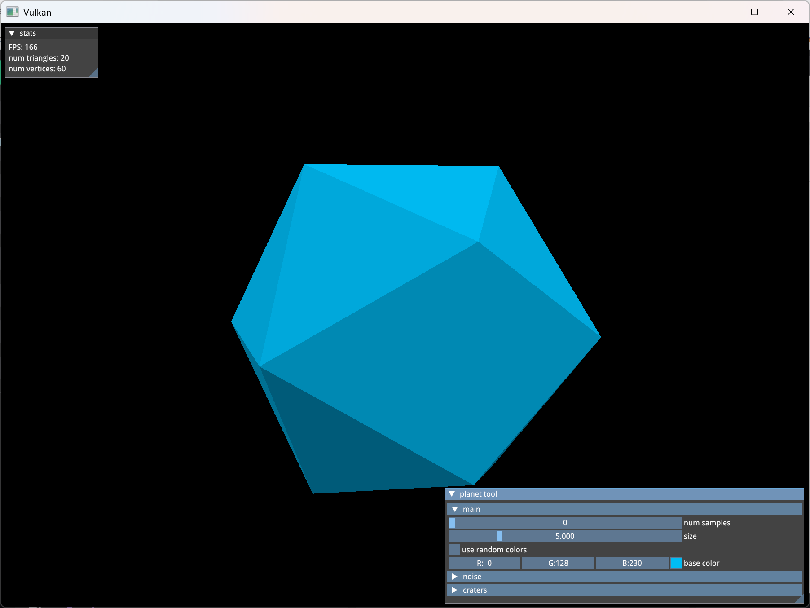

All the settings!

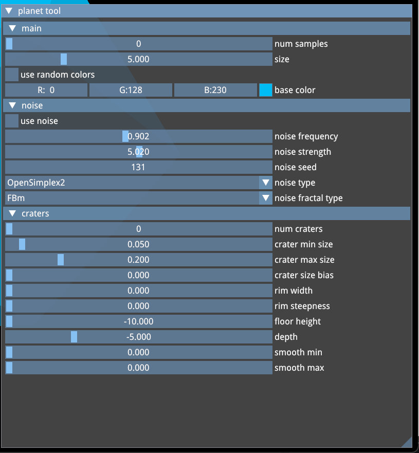

When samples are set to 1, so 1 subdivision of the original icosahedron.

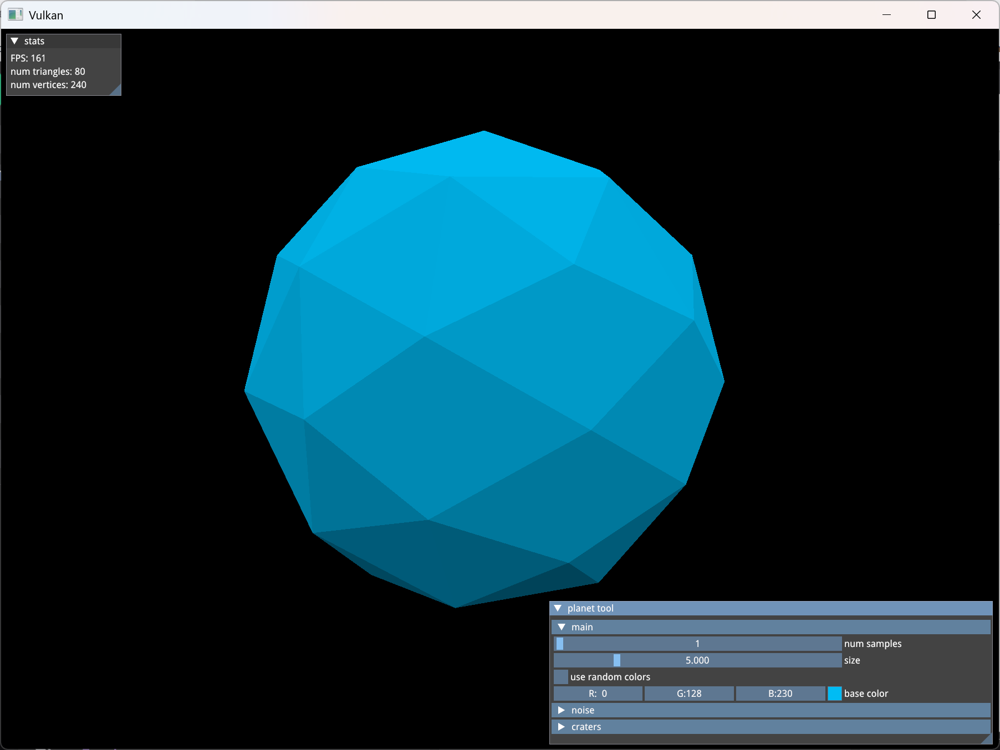

10 samples with random triangle colors for better visualisation

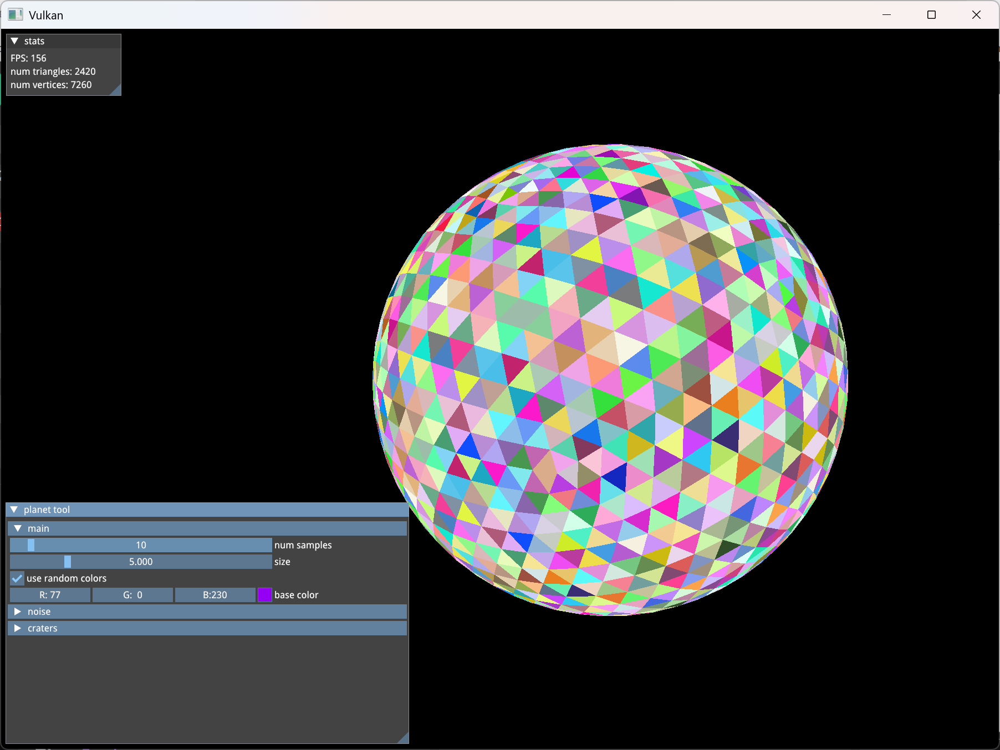

Lots of samples!

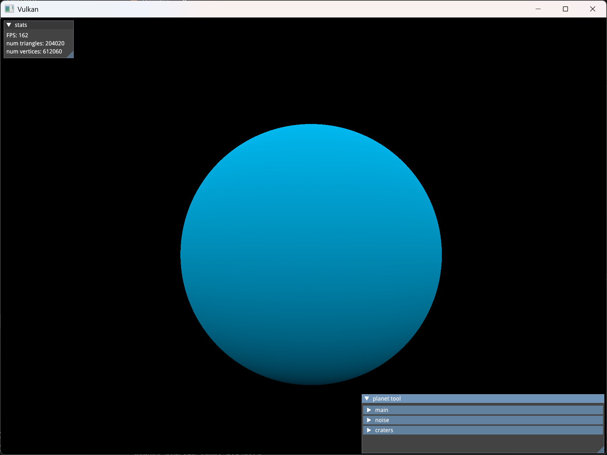

With noise!!!

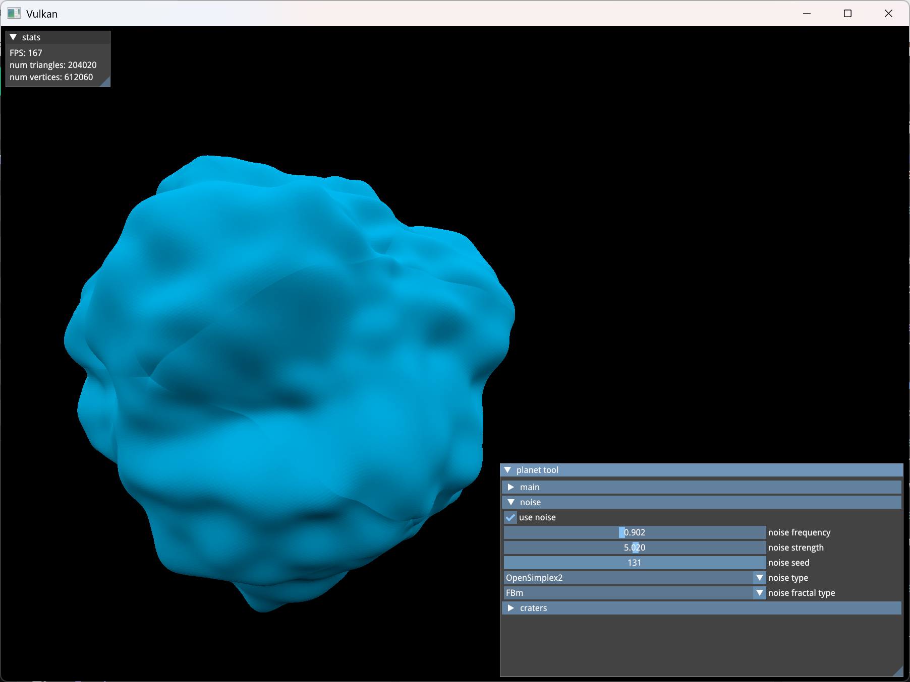

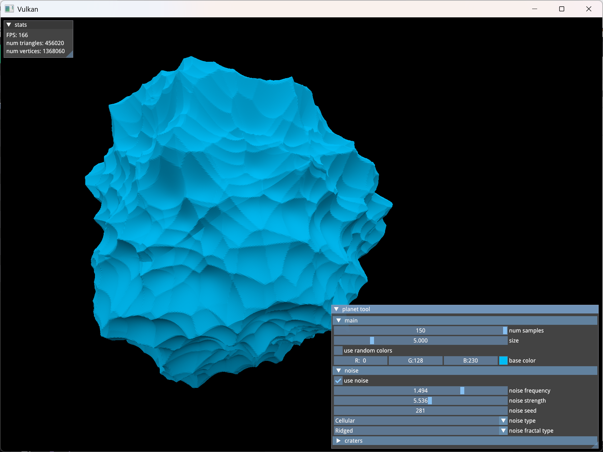

Just to get an idea of the amount of triangles

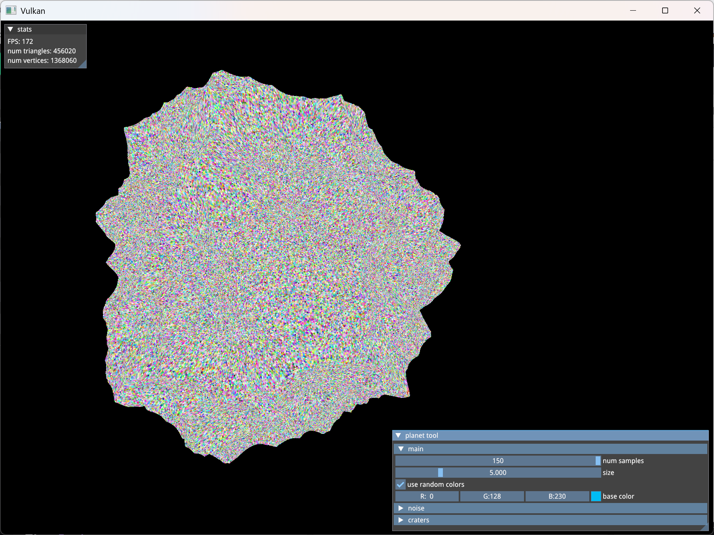

Craters oooohh.

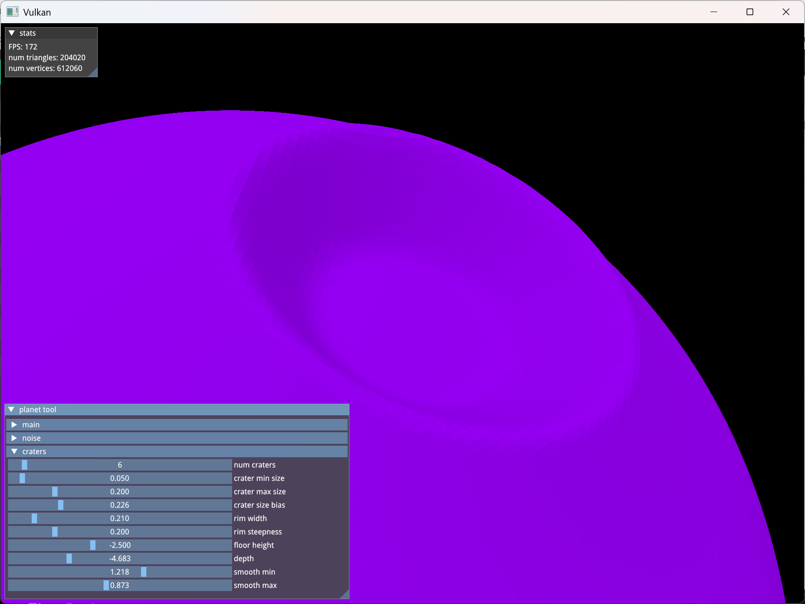

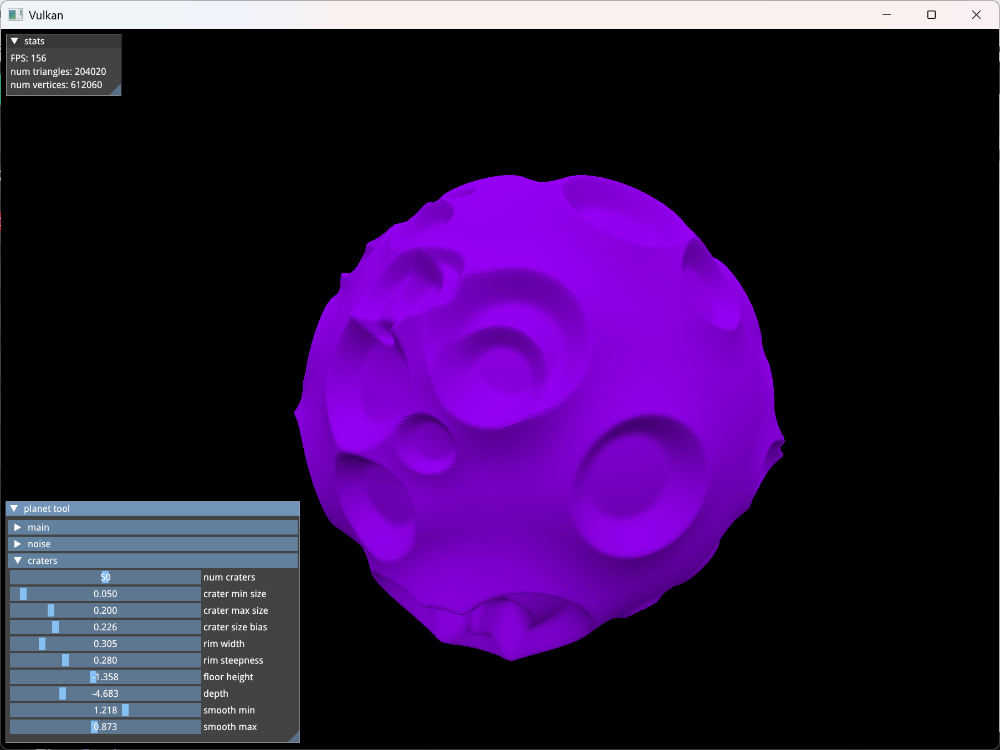

Craters + Noise yay.

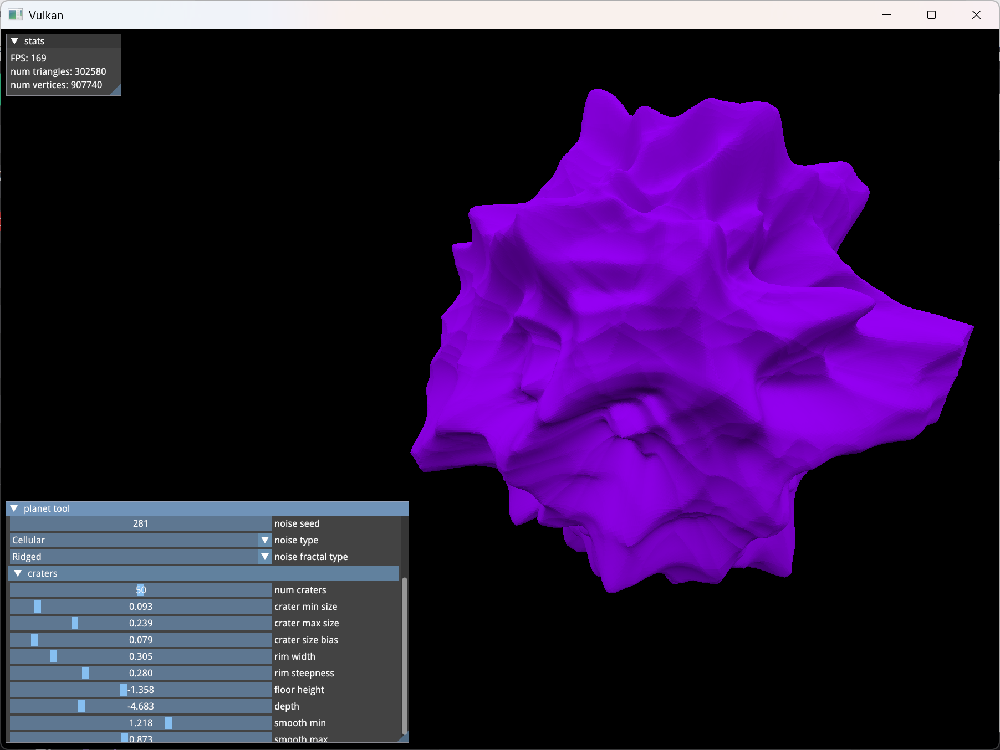

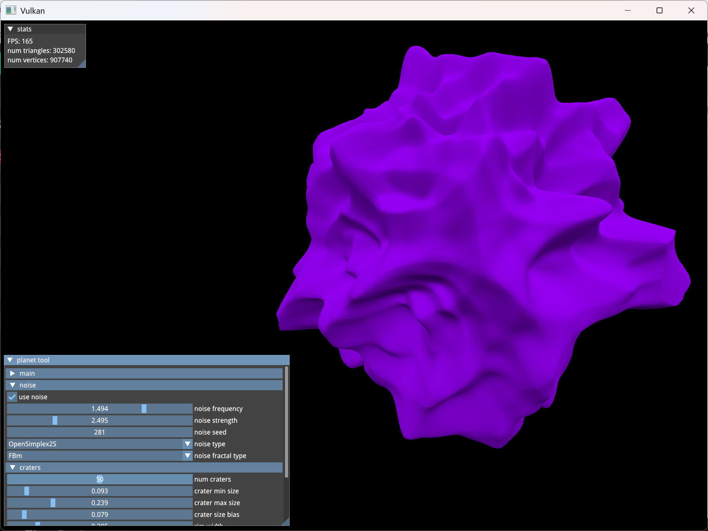